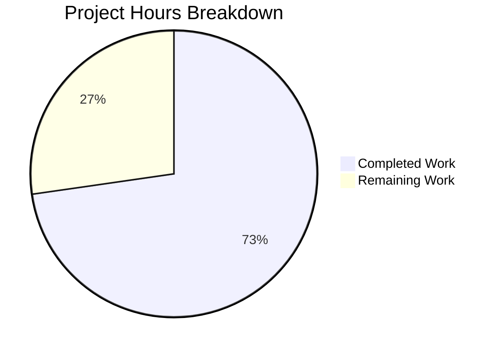

# Project Guide — Node.js Express Tutorial Application with Jest Test Suite

## Executive Summary

This project implements a greenfield Node.js + Express.js tutorial application with two HTTP endpoints and a comprehensive Jest/Supertest test suite, built from scratch on an initially empty repository containing only a `README.md`.

**Completion: 8 hours completed out of 11 total hours = 72.7% complete**

All items defined as in-scope by the Agent Action Plan (§0.8.1) have been fully implemented and validated:
- 6 files created (package.json, package-lock.json, app.js, server.js, jest.config.js, __tests__/app.test.js)
- 8/8 tests passing (100% pass rate)
- 100% code coverage on app.js (exceeds 90% target)
- All 5 validation gates passed (Dependencies, Compilation, Tests, Coverage, Runtime)
- 0 compilation errors, 0 test failures, 0 npm vulnerabilities

The remaining 3 hours consist of human process tasks: adding a `.gitignore`, code review/PR merge, optional README documentation, and deployment environment verification. No functional defects or blockers exist.

---

## Validation Results Summary

### Gate 1: Dependencies — PASSED
- All 378 npm packages installed successfully
- 0 vulnerabilities reported by `npm audit`
- Runtime: express@5.2.1 | Dev: jest@30.2.0, supertest@7.2.2

### Gate 2: Compilation — PASSED
- `app.js`: Loads successfully as an Express application function
- `server.js`: Loads successfully, correctly imports app.js
- `jest.config.js`: Loads as valid Jest configuration object
- `__tests__/app.test.js`: Valid syntax, all imports resolve

### Gate 3: Tests — PASSED (8/8 = 100%)
| Test Case | Status |
|-----------|--------|
| GET / — returns "Hello world" with status 200 | ✅ Pass |
| GET / — returns text/html content-type | ✅ Pass |
| GET / — handles query parameters gracefully | ✅ Pass |
| GET /evening — returns "Good evening" with status 200 | ✅ Pass |
| GET /evening — returns text/html content-type | ✅ Pass |
| GET /evening — handles query parameters gracefully | ✅ Pass |
| Unknown routes — returns 404 for undefined routes | ✅ Pass |
| Unknown routes — returns 404 for POST on GET-only routes | ✅ Pass |

### Gate 4: Coverage — PASSED
| File | Statements | Branches | Functions | Lines |
|------|-----------|----------|-----------|-------|
| app.js | 100% | 100% | 100% | 100% |
| server.js | 0% (excluded) | 0% (excluded) | 0% (excluded) | 0% (excluded) |

Coverage threshold of 90% on app.js: **EXCEEDED at 100%**
server.js is excluded from thresholds per AAP §0.7.1 (contains only port-binding logic).

### Gate 5: Runtime — PASSED
- Server starts on configured port (PORT=3999 tested)
- `GET /` → "Hello world" (HTTP 200, text/html) ✅
- `GET /evening` → "Good evening" (HTTP 200, text/html) ✅
- `GET /nonexistent` → "Not Found" (HTTP 404) ✅
- `POST /` → "Not Found" (HTTP 404) ✅
- Server stops cleanly ✅

### Fixes Applied During Validation
- **None required.** All agent-created code passed every validation gate on the first run without modifications. The Final Validator confirmed zero compilation errors, zero test failures, and zero runtime issues.

---

## Hours Breakdown and Completion Calculation

### Completed Hours: 8 hours

| Component | Hours | Details |
|-----------|-------|---------|
| Project scaffolding (package.json, npm install, lock file) | 1.5h | Dependency research, version compatibility validation, manifest creation |
| Express application (app.js — 47 lines) | 1.5h | Route handlers, 404 catch-all, Express 5 conventions, app/server separation |
| Server entry point (server.js — 35 lines) | 0.5h | Port configuration, app.listen() binding, module export |
| Jest configuration (jest.config.js — 52 lines) | 1.0h | Test environment, coverage thresholds, file patterns |
| Test suite (__tests__/app.test.js — 115 lines) | 2.0h | 8 test cases, Supertest integration, happy/edge/error paths |
| Validation and quality assurance | 1.5h | Running all 5 gates, runtime verification, coverage analysis |
| **Total Completed** | **8.0h** | |

### Remaining Hours: 3 hours

| Task | Raw Hours | After Multiplier (1.25x uncertainty) |
|------|-----------|--------------------------------------|
| Add .gitignore file | 0.5h | 0.5h |
| Code review and PR merge process | 0.75h | 1.0h |
| Update README.md with documentation | 0.75h | 1.0h |
| Verify deployment environment compatibility | 0.5h | 0.5h |
| **Total Remaining** | **2.5h** | **3.0h** |

### Completion Calculation

```
Completed Hours: 8
Remaining Hours: 3 (after 1.25x uncertainty multiplier on raw 2.5h)
Total Project Hours: 8 + 3 = 11
Completion: 8 / 11 × 100 = 72.7%
```

### Visual Representation



---

## Detailed Human Task Table

All remaining tasks for human developers to complete before production readiness. Task hours sum to exactly 3.0 hours, matching the "Remaining Work" in the pie chart above.

| # | Task | Priority | Severity | Hours | Action Steps |
|---|------|----------|----------|-------|-------------|
| 1 | Add `.gitignore` file | High | Medium | 0.5h | Create `.gitignore` at project root containing `node_modules/`, `coverage/`, and `*.log`. This prevents committing generated artifacts to version control. |
| 2 | Code review and PR merge | High | High | 1.0h | Review all 6 created files for correctness, verify test output locally, approve and merge the PR. Validate that Express 5 conventions and Jest 30 matcher syntax are followed correctly. |
| 3 | Update README.md with documentation | Medium | Low | 1.0h | Add project description, prerequisites (Node.js 20+), installation steps (`npm install`), usage instructions (`node server.js`), test commands (`npm test`, `npm run test:coverage`), and endpoint documentation. Note: This was explicitly marked out-of-scope in the AAP but is recommended for developer experience. |
| 4 | Verify deployment environment | Medium | Medium | 0.5h | Confirm Node.js v20.20.0 is available in the target deployment environment. Run `npm install` and `npm test` in the target environment to verify all dependencies resolve and tests pass outside the development machine. |
| | **Total Remaining Hours** | | | **3.0h** | |

---

## Comprehensive Development Guide

### 1. System Prerequisites

| Requirement | Version | Verification Command |
|-------------|---------|---------------------|
| Node.js | v20.20.0 or higher | `node -v` |
| npm | v11.x or higher | `npm -v` |
| Git | Any recent version | `git --version` |

No databases, message queues, Docker, or external services are required. The application is fully self-contained.

### 2. Environment Setup

```bash
# Clone the repository
git clone <repository-url>
cd <repository-directory>

# Verify Node.js version (must be v20+)
node -v
# Expected output: v20.20.0

# No environment variables are required for development.
# The server defaults to port 3000. Override with:
export PORT=3000  # Optional — already defaults to 3000
```

### 3. Dependency Installation

```bash
# Install all dependencies (runtime + dev)
npm install

# Verify installation
npm ls --depth=0
# Expected output:
#   ├── express@5.2.1
#   ├── jest@30.2.0
#   └── supertest@7.2.2

# Verify no vulnerabilities
npm audit
# Expected output: found 0 vulnerabilities
```

### 4. Running Tests

```bash
# Run the full test suite
npm test
# Expected output:
#   PASS __tests__/app.test.js
#   GET /
#     ✓ should return "Hello world" with status 200
#     ✓ should return text/html content-type
#     ✓ should handle query parameters gracefully
#   GET /evening
#     ✓ should return "Good evening" with status 200
#     ✓ should return text/html content-type
#     ✓ should handle query parameters gracefully
#   Unknown routes
#     ✓ should return 404 for undefined routes
#     ✓ should return 404 for POST on GET-only routes
#   Tests: 8 passed, 8 total

# Run tests with coverage reporting
npm run test:coverage
# Expected: app.js at 100% across all metrics

# CI-safe execution (non-interactive, no watch mode)
CI=true npx jest --watchAll=false --ci --forceExit

# Run a specific test by name
npx jest --testNamePattern="Hello world"
```

### 5. Starting the Application

```bash
# Start the server (default port 3000)
node server.js
# Expected output: Server is running on port 3000

# Start on a custom port
PORT=8080 node server.js
# Expected output: Server is running on port 8080

# Using npm start script
npm start
```

### 6. Verification and Example Usage

Once the server is running, test the endpoints:

```bash
# Test the Hello World endpoint
curl http://localhost:3000/
# Expected response: Hello world

# Test the Good Evening endpoint
curl http://localhost:3000/evening
# Expected response: Good evening

# Test 404 handling for unknown routes
curl -i http://localhost:3000/nonexistent
# Expected: HTTP/1.1 404 Not Found
# Body: Not Found

# Test method enforcement (POST on GET-only route)
curl -X POST http://localhost:3000/
# Expected: Not Found (HTTP 404)
```

### 7. Project Structure

```
├── README.md              # Project readme (placeholder)
├── package.json           # Dependencies and npm scripts
├── package-lock.json      # Dependency lock file (378 packages)
├── app.js                 # Express app with routes (GET /, GET /evening, 404 handler)
├── server.js              # Server entry point (app.listen on PORT)
├── jest.config.js         # Jest configuration with coverage thresholds
├── __tests__/
│   └── app.test.js        # 8 test cases for all endpoints
├── coverage/              # Generated coverage reports (gitignored)
└── node_modules/          # Installed dependencies (gitignored)
```

### 8. Key Architectural Decisions

- **App/Server Separation:** `app.js` exports the Express instance without calling `.listen()`. `server.js` imports it and binds to a port. This enables Supertest to test routes without port conflicts or open handles.
- **Express 5.x:** Uses Express 5.2.1 with `path-to-regexp@8.x` conventions. The 404 handler uses middleware-style catch-all (`app.use()` without a path).
- **CommonJS Modules:** All files use `require()`/`module.exports` — no ES module syntax.
- **Jest 30 Canonical Matchers:** Tests use `.toBe()`, `.toMatch()` — no removed aliases.

### 9. Troubleshooting

| Issue | Solution |
|-------|----------|
| `npm test` enters watch mode | Run with `CI=true npm test` or `npx jest --watchAll=false` |
| Port already in use | Change port: `PORT=3001 node server.js` or kill the process using the port |
| Jest open handle warning | Add `--forceExit` flag: `npx jest --forceExit` |
| Tests fail after dependency update | Run `npm ci` for clean install from lock file |

---

## Risk Assessment

### Technical Risks

| Risk | Severity | Likelihood | Mitigation |
|------|----------|-----------|------------|
| Missing `.gitignore` causes `node_modules/` to be committed | Medium | High | **Human Task #1:** Create `.gitignore` before any additional commits |
| Jest `--forceExit` warning in CI | Low | Medium | Supertest connections close naturally; `--forceExit` is a safety net, not a defect |
| Express 5 is relatively new — API stability | Low | Low | Pinned to 5.2.1 via lock file; all Express 5 conventions correctly followed |

### Security Risks

| Risk | Severity | Likelihood | Mitigation |
|------|----------|-----------|------------|
| No CORS, authentication, or rate limiting | Low | N/A | Explicitly out-of-scope per AAP §0.8.2; this is a tutorial application |
| 0 npm audit vulnerabilities currently | Info | Low | Run `npm audit` periodically; update dependencies if vulnerabilities are reported |

### Operational Risks

| Risk | Severity | Likelihood | Mitigation |
|------|----------|-----------|------------|
| No process manager (PM2, systemd) for production | Low | N/A | Out-of-scope for tutorial; add if deploying to production |
| No logging framework beyond `console.log` | Low | N/A | Sufficient for tutorial scope; add Winston/Pino if production logging needed |
| No health check endpoint | Low | Low | Add `GET /health` if deployment monitoring is required |

### Integration Risks

| Risk | Severity | Likelihood | Mitigation |
|------|----------|-----------|------------|
| No CI/CD pipeline configured | Medium | N/A | **Human Task #2** during code review: consider adding GitHub Actions workflow |
| Node.js version mismatch in deployment | Medium | Low | **Human Task #4:** Verify Node.js v20.20.0 in target environment; `engines` field in package.json enforces >=20.0.0 |

---

## Scope Compliance Summary

### In-Scope Items — ALL DELIVERED ✅

| Deliverable | Status | Evidence |
|-------------|--------|----------|
| `package.json` with Express, Jest, Supertest | ✅ Complete | express@5.2.1, jest@30.2.0, supertest@7.2.2 declared |
| `app.js` — Express app with 2 routes + 404 | ✅ Complete | 47 lines, exports app without listen() |
| `server.js` — Server entry point | ✅ Complete | 35 lines, imports app.js, binds to PORT |
| `jest.config.js` — Test configuration | ✅ Complete | 52 lines, Node env, 90% threshold on app.js |
| `__tests__/app.test.js` — Test suite | ✅ Complete | 115 lines, 8 tests, 100% pass rate |
| GET / returns "Hello world" (status 200) | ✅ Complete | Test + runtime verified |
| GET /evening returns "Good evening" (status 200) | ✅ Complete | Test + runtime verified |
| 404 for unknown routes | ✅ Complete | Test + runtime verified |
| HTTP method enforcement (POST on GET routes) | ✅ Complete | Test + runtime verified |
| 90%+ coverage on app.js | ✅ Complete | Achieved 100% |

### Out-of-Scope Items (per AAP §0.8.2)

Not implemented by design: advanced middleware, database/persistence, environment configuration (.env), deployment (Docker/CI), TypeScript, E2E testing, performance testing, linting/formatting, README.md updates.

---

## Git History

| Commit | Author | Description |
|--------|--------|-------------|
| `0327da0` | Blitzy Agent | Add package.json with Express, Jest, and Supertest dependencies |
| `4274aaa` | Blitzy Agent | Add package-lock.json for reproducible dependency resolution |
| `9f31efc` | Blitzy Agent | Create Express application module with GET / and GET /evening endpoints and 404 handler |
| `0ea4465` | Blitzy Agent | Add Jest configuration for Node.js Express tutorial application |
| `c25c042` | Blitzy Agent | Create server.js: Express server entry point separated from app.js for Supertest testability |
| `0624efb` | Blitzy Agent | Add comprehensive test suite for Express tutorial app endpoints |

**6 commits** on branch `blitzy-aab79b8a-517f-4fec-9347-65c6bd78add7` | **6 files created** | **5,701 lines added** (5,424 in package-lock.json, 277 in source/config/test files) | **0 lines removed** | Git working tree is clean.
